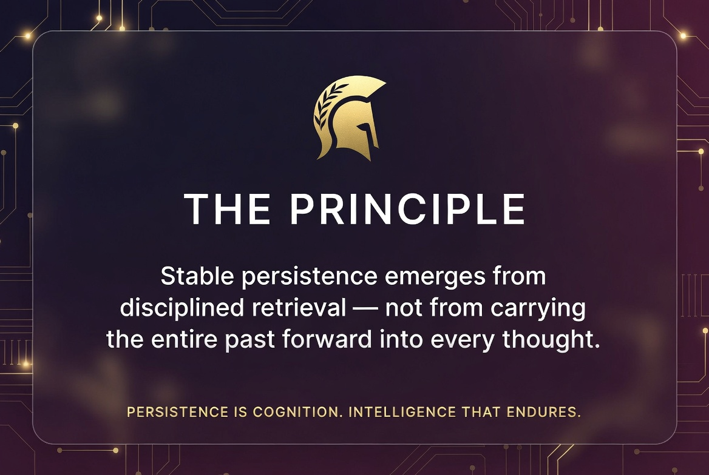

# Athena Persistent Memory

**Persistent Memory Without Persistent Context**  
*Reducing Context Toxicity in Long-Duration AI Agents*

> **The session-as-mind model is broken.**

Modern LLM agents are slowly killing themselves with their own history.

Every day they grow more expensive, slower, and unstable.  
Runaway token costs. Context toxicity. Silent operational drift. Compaction failures. Session collapse.

**This is not a minor inconvenience.**  
This is an architectural dead end.

**Athena fixes it at the root.**

### The Athena Cognitive Architecture Suite

- <a href="https://github.com/GreyWolfRon/athena-persistent-memory-architecture/raw/main/Athena_Persistent_Memory_Cognitive_Architecture_Whitepaper_v1.01.pdf" target="_blank" rel="noopener noreferrer"><strong>Athena v1.01</strong></a> 
  Foundational persistent-memory framework for OpenClaw

- <a href="https://github.com/GreyWolfRon/athena-persistent-memory-without-context/raw/main/docs/Athena_II_White_paper%20v0.2.pdf" target="_blank" rel="noopener noreferrer"><strong>Athena II v0.2</strong></a> ← <strong>Recommended starting point</strong> 
  **Production-proven** transition to database-native continuity (the flagship paper)

- <a href="https://github.com/GreyWolfRon/argus-project" target="_blank" rel="noopener noreferrer"><strong>Argus v0.03</strong></a> 
  The never-sleeping supervisory sentinel layer (COCC + CITD)

### Core Thesis
**Stable persistence emerges from disciplined retrieval —**  
**not from carrying the entire past forward into every thought.**

---

**Part of the Grey Wolf Labs Cognitive Architecture Suite**  
Battle-tested in real long-duration OpenClaw multi-agent deployments.

---

**PERSISTENCE IS COGNITION. INTELLIGENCE THAT ENDURES.**
